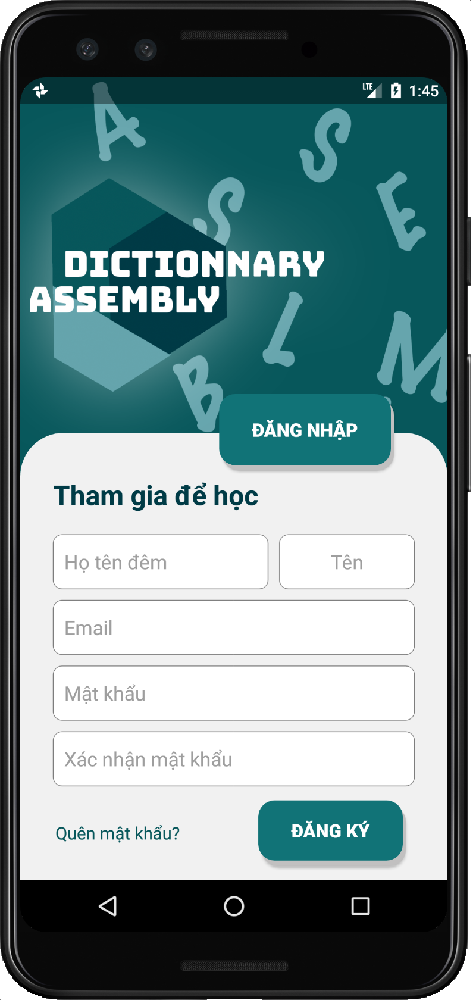
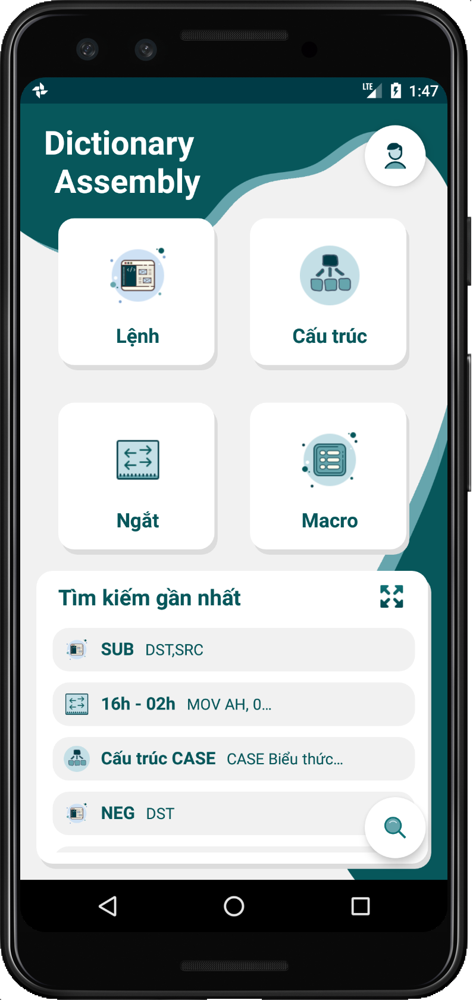
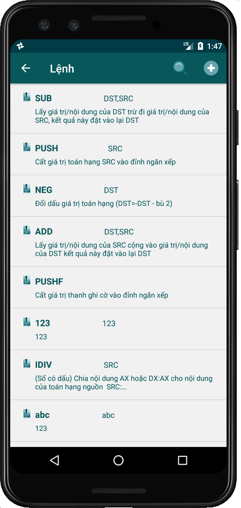
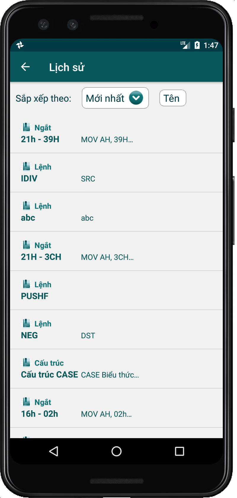
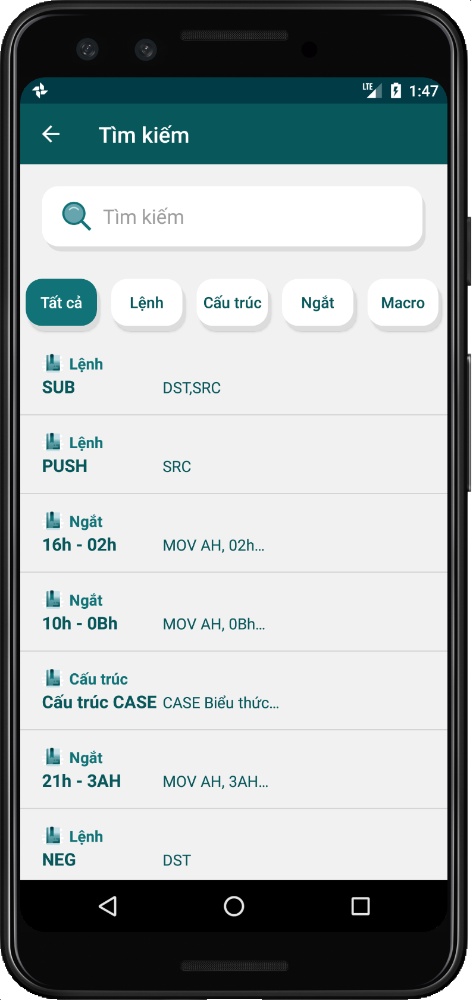
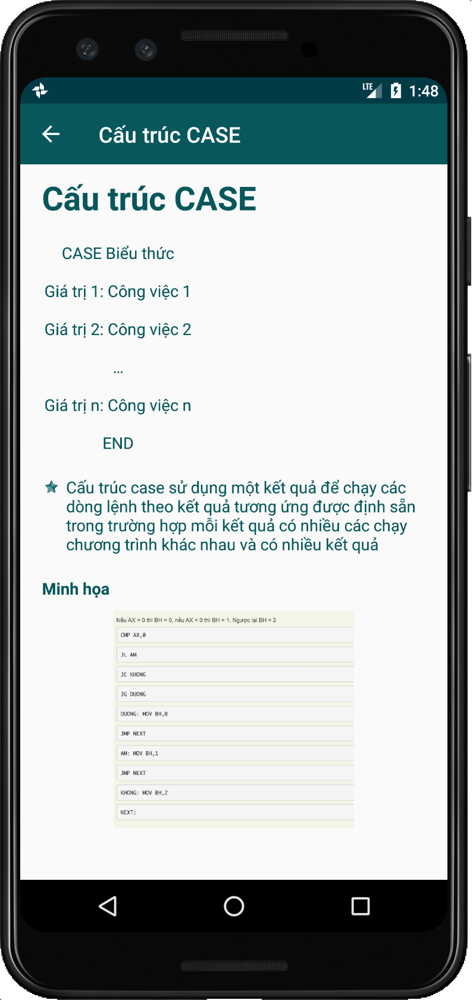
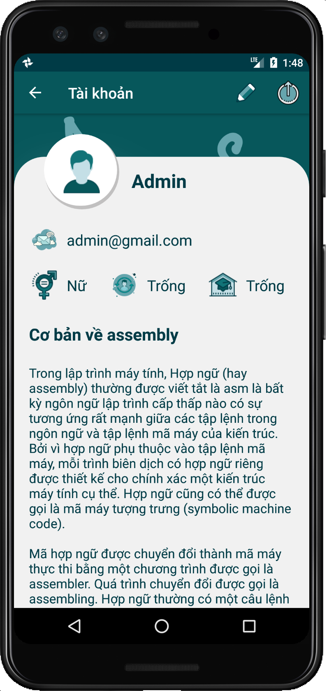
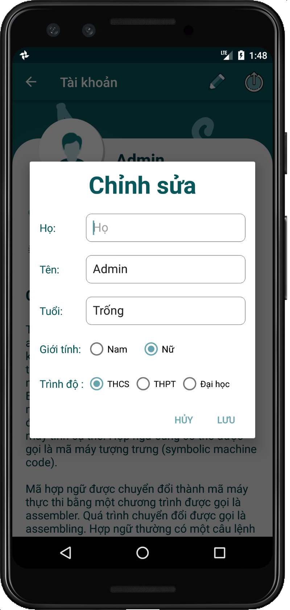
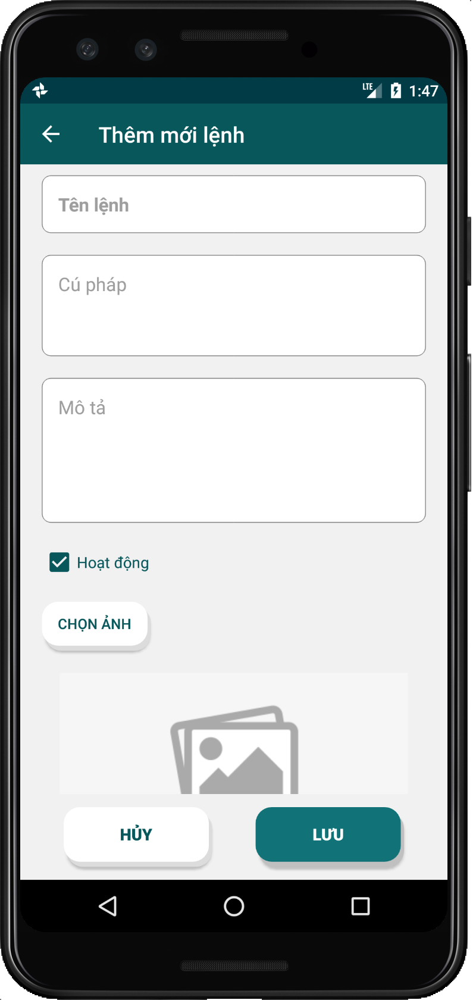
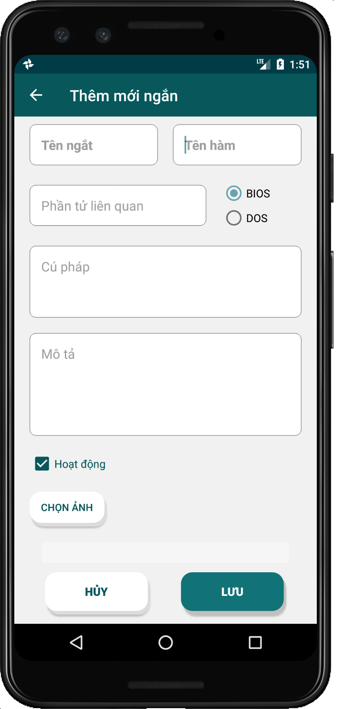

# Dictionary Assembly

Dictionary Android App using Firebase

## Features 
* Account management
* Manage user information
* View assembly library information
* Real-time updates and personal viewing history

## Libraries 
* [Firebase](https://github.com/firebase/)
* [Picasso](https://github.com/square/picasso)
* [TouchImageView for Android](https://github.com/MikeOrtiz/TouchImageView)

## Screen Shot
|  |  |  | |
| - | - | - | - |
|  |  |  | |
|  |  |  | |

## Support
* Android 5.0 +

## Development team
* [Phuc Tran Ba](https://github.com/phuctranba)

## Development purpose
Personal projects
